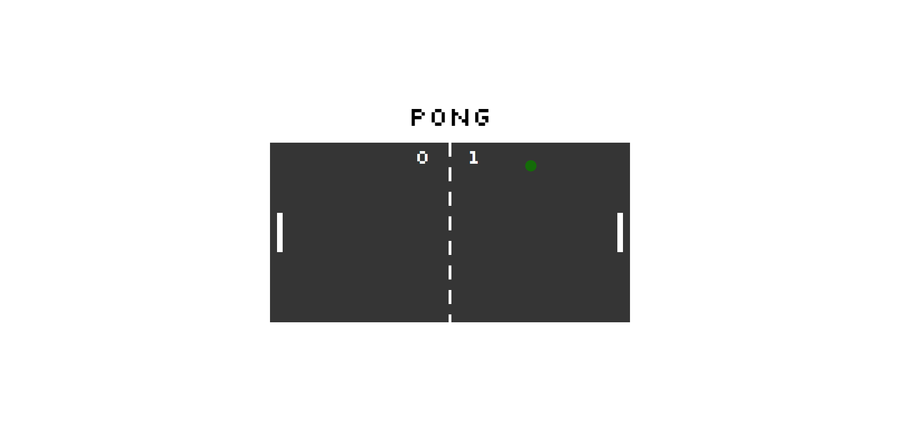

# Pong Game

A basic pong game using SVGs. This game was built to show the JavaScript skills of the students of RED Academy. In this game, I looped throught an array to make the ball change colors when it goes out of bounds or hits a paddle, as well as declared a winner (at 10 points).

# Setup

**Install dependencies:**

`> npm i`

**Run locally with Webpack Dev Server:**

`> npm start`

**Build for production:**

`> npm run build`

# Keys

**Player 1:**
* a: up
* z: down

**Player 2:**
* ▲ : up
* ▼: down

# Reflections

This game helped me to better understand how JavaScript Partials work in relation to each other, as well as giving me a better understanding of "vanilla" JavaScript. It allowed me to work throught the basics of the game with the instructor, and then come up with ,y own creative spins on how I could change the game. 